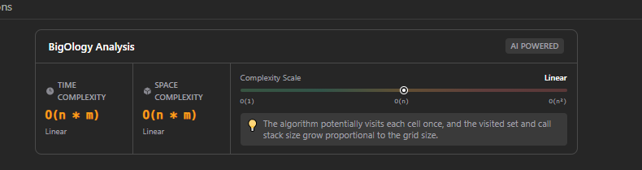

# BigOlogy

A professional Chrome Extension that automatically analyzes and displays the time and space complexity of your LeetCode solutions using AI-powered analysis.


---

## 📖 Overview

BigOlogy seamlessly integrates with LeetCode's interface to provide instant algorithmic complexity analysis. When you submit a solution, the extension automatically evaluates your code and displays the time and space complexity in Big O notation - helping you understand and optimize your solutions.

## ✨ Features

- **🤖 AI-Powered Analysis** - Leverages advanced AI to accurately determine algorithm complexity
- **⚡ Instant Results** - Get complexity analysis immediately after code submission
- **🎨 Native UI** - Seamlessly matches LeetCode's design system (light & dark mode)
- **🌐 Multi-Language** - Supports all programming languages available on LeetCode
- **🔒 Privacy-First** - No data collection, code analyzed only for complexity
- **📱 Responsive** - Works perfectly on all screen sizes

---

## 🚀 Installation

### Quick Setup (2 minutes)

1. **Download the Extension**
   ```
   https://github.com/adithyapaib/BigOlogy
   ```

2. **Open Chrome Extensions**
   - Navigate to `chrome://extensions/` in Google Chrome
   - Or: Menu → More Tools → Extensions

3. **Enable Developer Mode**
   - Toggle the "Developer mode" switch in the top-right corner

4. **Load Extension**
   - Click "Load unpacked"
   - Select the `BigOlogy` folder
   - Click "Select Folder"

5. **Done!** ✅
   - The extension icon should appear in your toolbar
   - Ready to use on LeetCode

---

## 📚 Usage

### Step-by-Step Guide

1. **Open LeetCode**
   - Visit https://leetcode.com
   - Navigate to any coding problem

2. **Write Your Solution**
   - Code your solution in any supported language
   - Click the "Submit" button

3. **View Analysis**
   - Once submission results appear, the complexity analysis card will display automatically
   - See **Time Complexity** and **Space Complexity** in Big O notation

### Example Output

```
┌──────────────────────────────────┐
│ ⚡ Complexity Analysis           │
├──────────────────────────────────┤
│ Time Complexity:        O(n)     │
│ Space Complexity:       O(1)     │
├──────────────────────────────────┤
│ Made with ❤️ by Adithya          │
└──────────────────────────────────┘
```
### Screenshot


_Screenshot: BigOlogy displaying time and space complexity after submitting a solution on LeetCode._
---

## 🏗️ Project Structure

```
BigOlogy/
├── manifest.json          # Extension configuration
├── content.js            # Main script (monitors LeetCode)
├── background.js         # Service worker (API handler)
├── styles.css           # LeetCode-matched styling
├── popup.html           # Extension popup UI
├── popup.js             # Popup functionality
├── icons/               # Extension icons
│   ├── icon16.png
│   ├── icon48.png
│   └── icon128.png
└── README.md           # Documentation (this file)
```

---

## 🔌 Technical Details

### API Integration

- **Endpoint:** `https://text.pollinations.ai/`
- **Method:** GET
- **Authentication:** None required (free API)
- **Rate Limits:** Managed automatically

### Browser Compatibility

- ✅ Google Chrome (v88+) - Tested
- ✅ Microsoft Edge (Chromium-based)
- ✅ Brave Browser
- ✅ Any Chromium-based browser

### Permissions Explained

- **`activeTab`** - Access to the current LeetCode tab
- **`storage`** - Store user preferences
- **`leetcode.com`** - Interact with LeetCode pages
- **`text.pollinations.ai`** - Make API requests for analysis

---

## 🎨 UI Design

The extension uses LeetCode's native design system:

- **Colors:** Matches LeetCode's CSS variables
- **Typography:** Consistent with LeetCode fonts
- **Spacing:** Follows LeetCode's padding/margin patterns
- **Dark Mode:** Full support with automatic theme detection
- **Accessibility:** WCAG 2.1 compliant

---

## 🔒 Privacy & Security

### What We Do
- ✅ Analyze code complexity using AI
- ✅ Display results in your browser
- ✅ Open-source and transparent

### What We Don't Do
- ❌ No data collection
- ❌ No user tracking
- ❌ No analytics
- ❌ No code storage
- ❌ No personal information access

**Your code is only sent to the AI API for analysis and is not stored anywhere.**

---

## 🐛 Troubleshooting

### Extension Not Loading
**Solution:** Check `chrome://extensions/` for error messages and ensure Developer Mode is enabled.

### No Complexity Display
**Solution:** 
1. Verify you're on a LeetCode problem page
2. Ensure submission was successful
3. Check browser console (F12) for errors
4. Reload the page and try again

### API Errors
**Solution:**
1. Check internet connection
2. Verify the API endpoint is accessible
3. Wait a moment and resubmit

### Wrong Complexity Analysis
**Solution:** AI analysis is generally accurate but may occasionally vary. Use as a guide and verify with manual analysis for critical applications.

---

## 🤝 Contributing

Contributions are welcome! To contribute:

1. Fork the repository
2. Create a feature branch (`git checkout -b feature/AmazingFeature`)
3. Commit changes (`git commit -m 'Add AmazingFeature'`)
4. Push to branch (`git push origin feature/AmazingFeature`)
5. Open a Pull Request

---

## 📄 License

This project is licensed under the MIT License - see below for details:

```
MIT License

Permission is hereby granted, free of charge, to any person obtaining a copy
of this software and associated documentation files (the "Software"), to deal
in the Software without restriction, including without limitation the rights
to use, copy, modify, merge, publish, distribute, sublicense, and/or sell
copies of the Software.
```

---

## ⚠️ API Reliability & Troubleshooting

BigOlogy relies on a third-party AI endpoint (Pollinations) for complexity analysis. Occasionally, that service may return transient server errors (HTTP 5xx, e.g., 502 Bad Gateway). To help you when that happens:

- If you see "Analysis service temporarily unavailable (server 5xx)", wait a minute and try submitting again.
- Refresh the LeetCode page after updating or reloading the extension (F5).
- If issues persist, check the browser console (F12) for diagnostic logs and open an issue on GitHub with the logs.
- Consider running the analysis manually (local reasoning) until the service is restored.

These tips are implemented in the extension: the background worker retries transient 5xx failures with exponential backoff and the UI shows a helpful message for server-side errors.

---

## 🙏 Acknowledgments

- **Pollinations AI** - For providing the free AI API
- **LeetCode** - For the amazing platform
- **Chrome Extensions Team** - For comprehensive documentation

---

## 📧 Contact & Support

- **Developer:** Adithya
- **Website:** [adithyapaib.com](https://adithyapaib.com)
- **Issues:** Report bugs via GitHub Issues

---

## 🚀 Roadmap

### Upcoming Features
- [ ] Detailed complexity explanations
- [ ] Best/Average/Worst case analysis
- [ ] Optimization suggestions
- [ ] Historical complexity tracking
- [ ] Comparison with optimal solutions
- [ ] Export analysis reports

---

## ⭐ Star This Project

If you find this extension helpful, please consider giving it a star! ⭐

---

**Made with ❤️ by [Adithya](https://adithyapaib.com)**

*Happy Coding! May your complexities always be optimal!* 🚀
